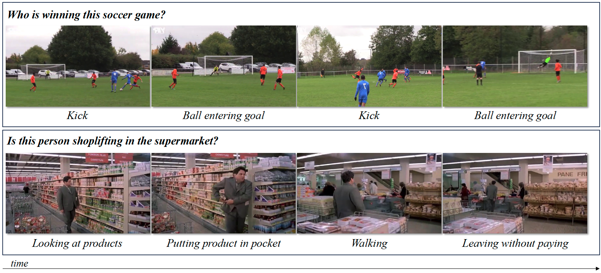

# Are current long-term video understanding datasets long-term?
Official repository of the paper "Are current long-term video understanding datasets long-term?", published in CVEU 2023 ([link](https://arxiv.org/pdf/2308.11244.pdf)).

## Abstract

Many real-world applications, from sport analysis to surveillance, benefit from automatic long-term action recognition. In the current deep learning paradigm for automatic action recognition, it is imperative that models are trained and tested on datasets and tasks that evaluate if such models actually learn and reason over long-term information. In this work, we propose a method to evaluate how suitable a video dataset is to evaluate models for long-term action recognition. To this end, we define a long-term action as excluding all the videos that can be correctly recognized using solely short-term information. We test this definition on existing long-term classification tasks on three popular real-world datasets, namely Breakfast, CrossTask, and LVU, to determine if these datasets are truly evaluating long-term recognition. Our study reveals that these datasets can be effectively solved using shortcuts based on short-term information. Following this finding, we encourage long-term action recognition researchers to make use of datasets that need long-term information to be solved.


Figure 1: Example of truly long-term actions. Top: _Who is winning this soccer game?_, Bottom: _Is this person shoplifting in the supermarket?_. In both cases, it is not possible to answer correctly without considering multiple short-term actions together, their order and relations over time.

## Contents

- `annotations/`: Contains the annotations for the video datasets used in our study and the timesteps used to create video segments.
- `src/`: Includes the code used to create the video segments, generate Figure 2 of the paper, calculate the user agreement and some common utils.
- `user_studies/`: Contains the code and data for the user studies conducted in the paper, as well as the results and analysis obtained.

## Citation

If you find this work helpful or use the code provided in this repository, please consider citing the paper:

```bibtex
@article{strafforello2023current,
  title={Are current long-term video understanding datasets long-term?},
  author={Strafforello, Ombretta and Schutte, Klamer and van Gemert, Jan},
  journal={Proceedings of the IEEE/CVF International Conference on Computer Vision Workshops},
  year={2023}
}
```

## Contact

For any inquiries or questions regarding the paper, code, or experiments, please feel free to contact o.strafforello@tudelft.nl.
